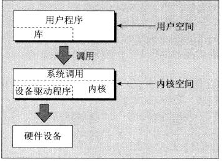

# chapter 3 linux 文件系统
## 文件结构
1. 5大基本函数：open close read write ioctl
2. 常用文件目录：
    1. / 根目录
    2. /bin 系统程序的可执行文件
    3. /etc 系统配置文件
    4. /lib 系统函数库
    5. /dev 物理设备以及设备借口
3. 重要的设备文件
    1. /dev/console 系统控制台
    2. /dev/tty /dev/tty0 /dev/tty1 ... 进程的控制终端,/dev/tty 是当前的shell
    ```bash
    echo “xxx” > /dev/tty ##将显示在当前的shell中
    ``` 
    3. /dev/null 是空设备，所有写向这个设备的输出都会被丢弃,读取这个设备会立即返回一个文件结尾标志
    ```bash
    cp /dev/null empty_file.txt ##复制空文件
    ```

## 系统调用和设备驱动程序
> 操作系统的核心部分，即内核，是一组<b>设备驱动程序</b>. 它们是一组对系统硬件进行控制的底层借口.

open: 打开文件或设备
read：从文件或设备里读数据
write：向文件或设备里写数据
close：关闭文件或设备
ioctl：把控制信息传递给设备驱动信息 

## 库函数
1. 针对输入输出操作直接使用底层的系统调用，使得效率十分低：内核切换+数据读取限制
2. 使用标准库函数

文件、用户、内核、硬件、驱动关系
关系图


## 底层文件的访问
1. 进程自带3个文件描述符：0-标准输入，1-标准输出，2-标准错误
### write 系统调用
头文件#include<unistd.h>
size_t write(int fildes,const void *buf ,size_t nbytes);
1. 将缓冲区buf的钱nbytes写入与文件描述符fildes 相关的文件种，返回实际写入的字节数目，遇到错误或其他原因，返回值小于nbytes。
2. 返回0表示没有写入
3. 返回-1 表示调用出错，，错误代码保存在全局变量errno里面
4. 标准输入、标准输出、标准错误在程序退出时会自动关闭，不用明确关闭，而在处理缓冲文件时则要显示声明关闭
5. 返回的字节少于期望字节不一定是错误，需要检查 errno来发现错误，然后继续调用写入剩余数据

### read 系统调用
头文件\#include<unistd.h>
size_t read(int fildes,void*buf,size_t nybtes);
1. 从fildes 读取nbytes个字节到buf中，返回读取字节数
2. 返回0表示没有读取字节，已达到文件末尾
3. 返回-1 表示调用出现错误
4. 可以通过重定向、管道为程序提供输入
```bash
echo hello there | ./using_read
./using_read < draft1.txt
```

### open() 系统调用
头文件：
\#include<fcntl.h>
\#include<sys/types.h>
\#include<sys/stat.h>

int open(const char *path,int oflags);
int open(const char *path, int oflags,mode_t mode);

1. 得到唯一的文件描述符,不会和其他进程共享
2. 两个进程同时操作一个文件，将会相互覆盖，需要提供文件锁来防止
3. oflags是指定文件访问模式

|文件访问模式|说明|
|------|------|
|O_RDONLY|以只读方式打开|
|O_WRONLY|以只写方式打开|
|O_RDWR|以读写方式打开|

|文件访问可选模式oflags|说明|
|------|------|
|O_APPEND|把写入数据追加在文件末尾|
|O_TRUNC|丢弃已有内容|
|O_CREAT|如有需要，按mode进行创建|
|O_EXCL|与O_CREAT一起确保不会创建出同名文件|

使用O_CTEAT标志的的open调用来创建文件，使用三个参数的open调用，第三个参数mode几个标志按位或后得到的，标志在sys/stat.h中定义
访问权限初始值
|标志|含义|
|------|-------|
|S_IRUSR|开启文件拥有者执行权限|
|S_IWUSR|开启文件拥有者写权限|
|S_IXUSR|开启文件拥有者执行权限|
|S_IRGRP|开启文件所属用户组读权限|
|S_IWGRP|开启文件所属用户组写权限|
|S_IXGRP|开启文件所属用户组执行权限|
|S_IROTH|开启文件其他用户读权限|
|S_IWOTH|开启文件其他用户写权限|
|S_IXOTH|开启文件其他用户执行权限|

例子：
```C
//文件拥有者拥有读权限，非用户非群组用户拥有执行权限
open("myfile",O_CREAT,S_IRUSR|S_IXOTH);
```

4. umask: 当文件被创建时，为文件的访问权限设定一个掩码。如果在umask中被置位，那么即便被创建时设定了该权限，最终也不会有该权限。但是用户可以用chmod进行改变权限
用法见书

### close() 系统调用
```c
#include<unistd.h>
int close(int fildes);
```
终止 文件描述符 fildes和 文件之间的关联关系
调用成功返回0，失败返回-1
<b>检查close()返回码，因为，有些网络文件系统的错误只有在关闭文件时才会被确认</b>

### ioctl() 系统调用
控制设备及其描述行为和配置底层服务的借口
```c
#include<unistd.h>
int ioctl(int fildes,int cmd,...);
```
对描述符引用的对象执行cmd参数中给出的操作，

### \#include<unistd.h> 必须放在行首，与POSIX标准有关，可能会影响到其他头文件

### 其他文件读写的系统调用
#### lseek()系统调用
头文件：
    \#include<unistd.h>
    \#include<sys/types.h>
格式
off_t lseek(int fildes,off_t offset, int whence);
返回值：正确时，返回被设置后的指针相对于文件开头的偏移量；失败时，返回-1
offset: 指定位置
whence：指定偏移用法，
|取值|含义|
|------|------|
|SEEK_SET|绝对位置|
|SEEK_CUR|相对当前的偏移位置|
|SEEK_END|相对文件尾的相对位置|

#### fstat(),stat(),lstat() 系统调用
函数原型
```c
#include<unistd.h>
#include<sys/stat.h>
#include<sys/types.h>
//buf 存储返回信息
int fstat(int fildes,struct stat *buf);
int stat(const char*path,struct stat *buf);
int lstat(const char*path,struct stat*buf);
```
stat()和lstat() 是通过文件名返回文件信息，但是当文件一个符号链接时，lstat() 返回符号链接本身信息，stat()返回符号链接指向的文件的信息
<b>通过struct stat *buf 查看文件信息</b>
具体使用方法参考书和实例代码

#### dup 和dup2系统调用
```c
#include<unistd.h>
int dup(int fildes); // 返回指向同一个文件的文件描述符
int dup(int fildes,int fildes2); //将fildes 复制到fildes2 
```

## 标准I/O 库
头文件
```c
#include<stdio.h>
```
### fopen()
```c
#include<stdio.h>
//成功返回一个 FILE* 指针，失败返回NULL值
FILE* fopen(const char* filename, const char* mode);
// mode 是字符串，而不是字符
```
1. mode中 b代表二进制文件
2. r+ 和w+ 都代表可读可写，但是w+会将原文件内容清空，r+不会；r+返回文件开头的指针，a+返回文件结尾指针。mode具体细节请参考[这里](https://www.cnblogs.com/kangjianwei101/p/5220021.html)

### rewind(FILE* fptr)
```c
#include<stdio.h>
FILE* fptr=open("filename","r");
//move fptr
rewind(fptr); //reset fptr to the beginning of file
```

### ftell(FILE* fptr);
```c
#include<stdio.h>
FILE* fptr=open("filename","r");
fseek(fptr,0,SEEK_END); //set fptr to be the end of file
long lsize=ftell(fptr);//返回fptr相对于文件开头的位移
rewind(fptr);
fclose(fptr);
```

### fread(), fwrite(),fclose()
```c
size_t fread(void *ptr,size_t size,size_t nitem,FILE*stream);//从stream文件指针处，读取nitem个 size字节长的数据记录，放到ptr处

size_t fwrite(const viod*ptr, size_t size, size_t nitems, FILE* stream);
//从ptr指针处读取nitem个 size 长的数据记录到stream处

int fclose(FILE* stream);
```

### int fflush(FIle* fptr)
将文件流中还未来得及写到文件的数据全部写出
fclose(ftpr) 会隐性调用fflush()，所以不用额外调用

### fseek()
```c
int fseek(FILE* STREAM, long int offset, int whence);
//对应lseek(),成功返回0，失败返回-1，失败时设置errno指出错误
```
